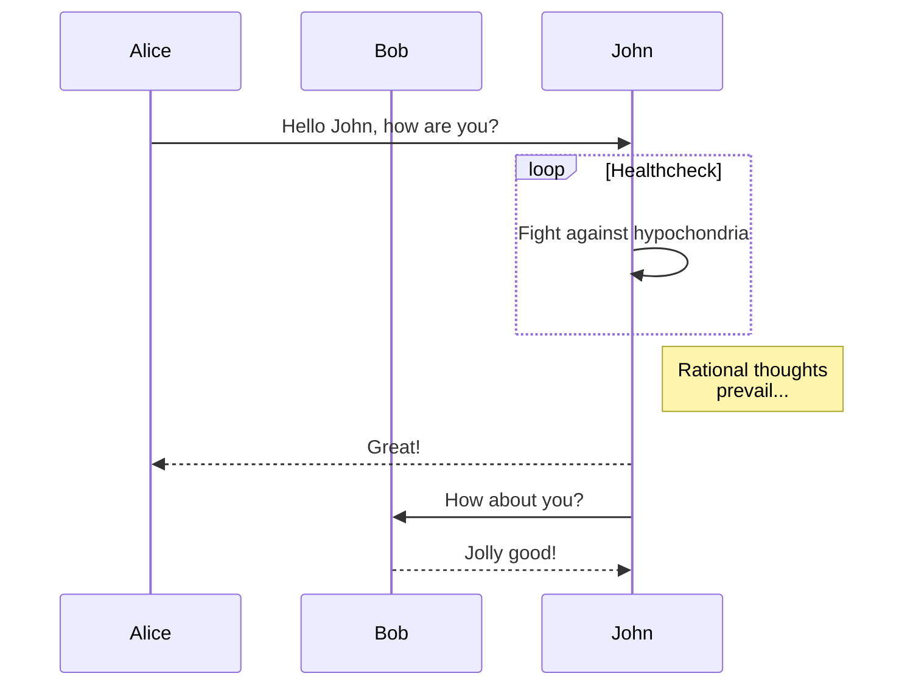

[color picker 取色](https://www.w3schools.com/colors/colors_picker.asp)
看到别人博客闪闪的，禁不住也想秀一个。好感慨前端技术发展的速度，奈何自己后端不咋样，前端也是个白痴，唉。

## particles.js 
[particles.js github主页](https://github.com/VincentGarreau/particles.js/)
[使用教程](http://blog.csdn.net/csdn_yudong/article/details/53128570)


<p data-height="265" data-theme-id="0" data-slug-hash="pnlso" data-default-tab="result" data-user="VincentGarreau" data-embed-version="2" data-pen-title="particles.js" class="codepen">See the Pen <a href="https://codepen.io/VincentGarreau/pen/pnlso/">particles.js</a> by Vincent Garreau (<a href="https://codepen.io/VincentGarreau">@VincentGarreau</a>) on <a href="https://codepen.io">CodePen</a>.</p>
<script async src="https://production-assets.codepen.io/assets/embed/ei.js"></script>

## canvas-nest.js
[canvas-nest.js github主页](https://github.com/hustcc/canvas-nest.js)
[canvas w3c](http://www.w3school.com.cn/html5/html_5_canvas.asp)

## mermaid 
一个非常棒的画流程图、时序图等工具，集成到博客中也很简单。
集成方法：[https://www.npmjs.com/package/hexo-filter-mermaid-diagrams](https://www.npmjs.com/package/hexo-filter-mermaid-diagrams)
命令：
```code
` ` ` mermaid
sequenceDiagram
    participant Alice
    participant Bob
    Alice->>John: Hello John, how are you?
    loop Healthcheck
        John->>John: Fight against hypochondria
    end
    Note right of John: Rational thoughts <br/>prevail...
    John-->>Alice: Great!
    John->>Bob: How about you?
    Bob-->>John: Jolly good!
` ` `
```

效果：


[more syntax](https://mermaidjs.github.io/)

其它类似工具：[plantuml](https://github.com/plantuml/plantuml)


